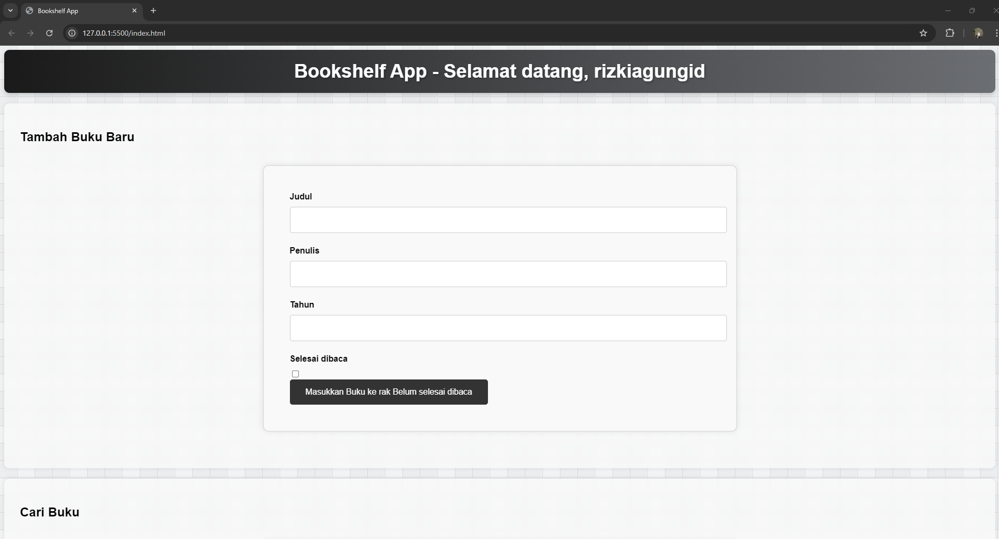

# 📚 Bookshelf App Starter Project



Ini adalah starter project untuk siswa yang sedang mengerjakan tugas akhir kelas Belajar Membuat Front-End Web untuk Pemula.

## Ketentuan Pengerjaan Tugas

Untuk mempermudah penilaian submission yang dikirim, Anda perlu memahami ketentuan-ketentuan berikut dalam mengerjakan tugas ini.

- Anda dilarang mengedit atau menghapus atribut `data-testid` pada elemen-elemen HTML.
- Ini masih berkaitan dengan poin sebelumnya. Jika Anda memiliki kebutuhan seperti styling elemen dan perlu menambahkan atribut seperti class, itu tidak dilarang selama atribut `data-testid` beserta nilainya tidak diubah atau dihapus.
- Dalam menampilkan data-data buku, Anda wajib memberikan beberapa atribut pada setiap elemennya.

### Atribut yang Wajib Ditambahkan
- `data-bookid`: Menampung nilai ID masing-masing buku.
- `data-testid`: Penanda jenis data buku yang ditampilkan. Berikut daftarnya:
  - `bookItem`: Elemen kontainer yang menampung data-data buku.
  - `bookItemTitle`: Judul buku.
  - `bookItemAuthor`: Penulis buku.
  - `bookItemYear`: Tahun rilis buku.
  - `bookItemIsCompleteButton`: Tombol untuk mengubah kondisi buku dari “Belum selesai dibaca” menjadi “Selesai dibaca” atau sebaliknya.
  - `bookItemDeleteButton`: Tombol untuk menghapus buku.
  - `bookItemEditButton`: Tombol untuk mengubah data buku.
  
Agar pengerjaan tugas lebih mudah, Anda dapat mengikuti template buku berikut.

```html
<div data-bookid="{{ ID_buku }}" data-testid="bookItem">
  <h3 data-testid="bookItemTitle">{{ judul_buku }}</h3>
  <p data-testid="bookItemAuthor">Penulis: {{ penulis_buku }}</p>
  <p data-testid="bookItemYear">Tahun: {{ tahun_rilis_buku }}</p>
  <div>
    <button data-testid="bookItemIsCompleteButton">{{ tombol_untuk_ubah_kondisi }}</button>
    <button data-testid="bookItemDeleteButton">{{ tombol_untuk_hapus }}</button>
    <button data-testid="bookItemEditButton">{{ tombol_untuk_edit }}</button>
  </div>
</div>